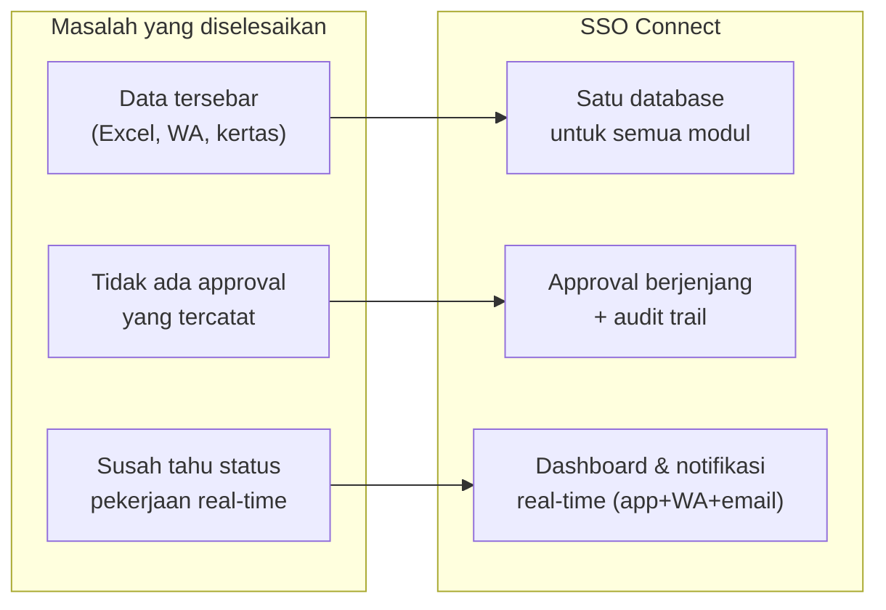
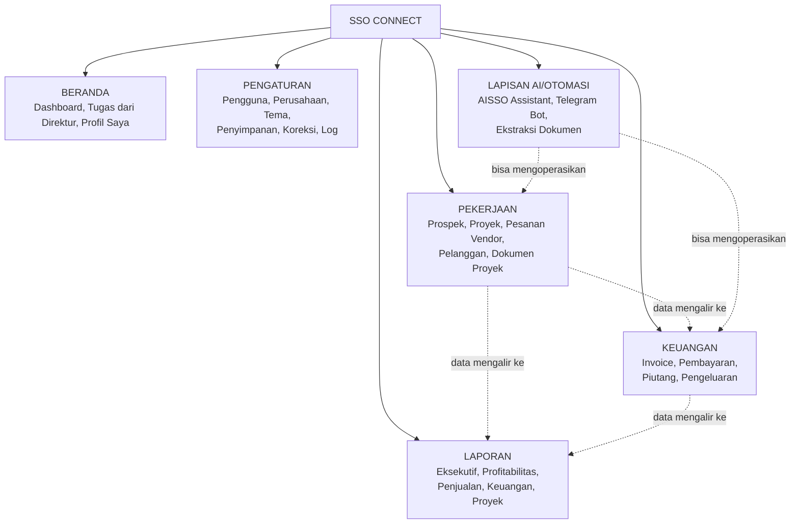
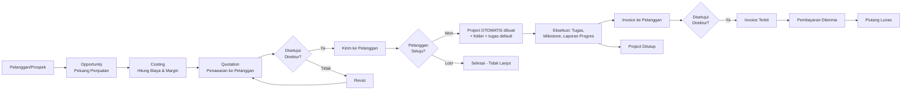
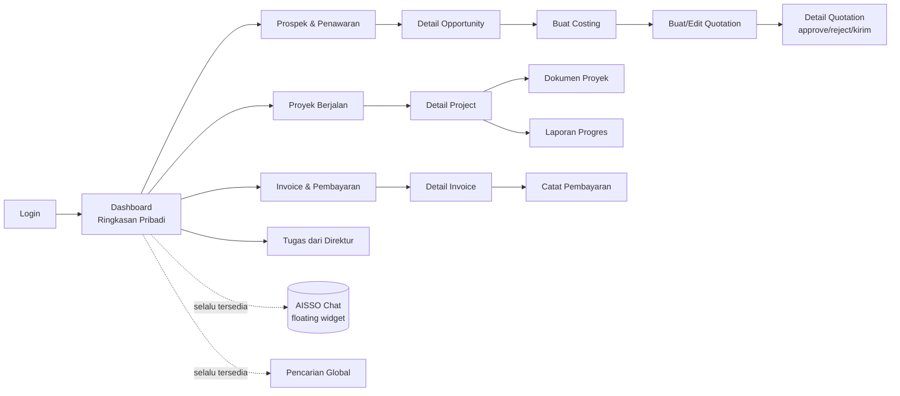
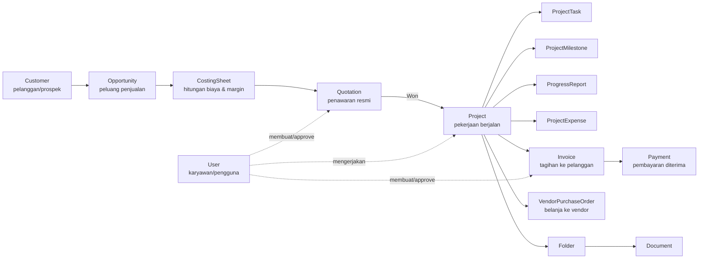
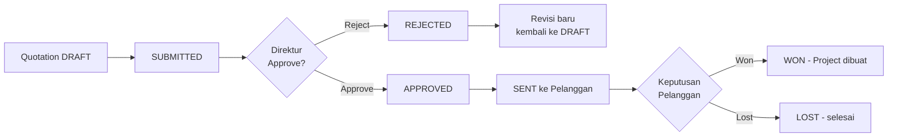
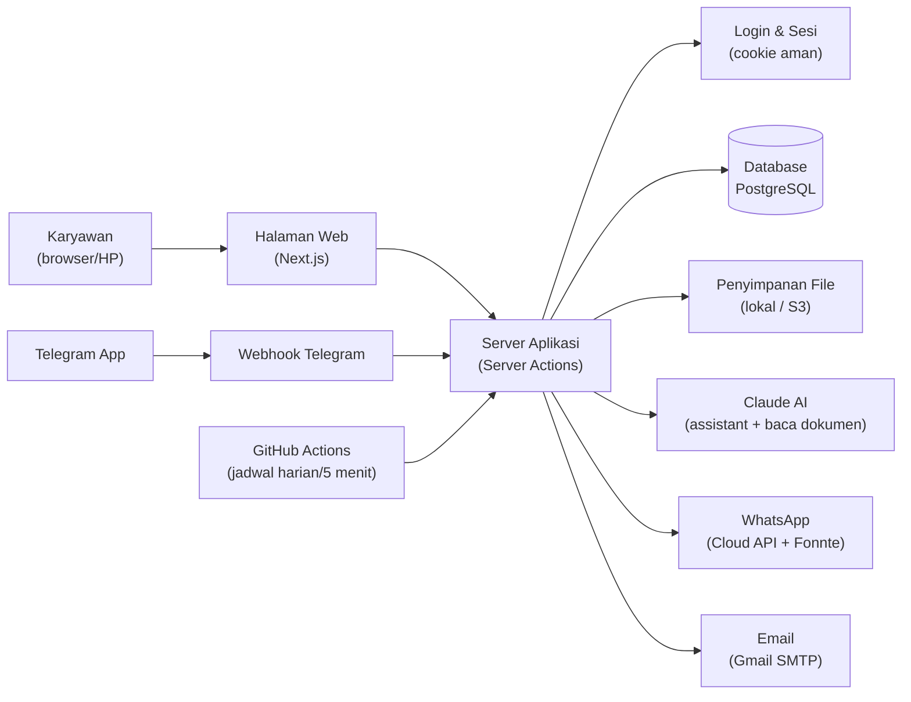
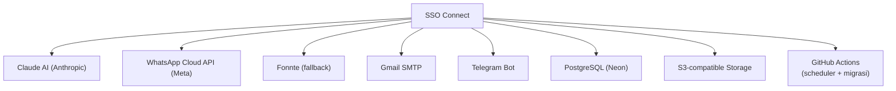

# SSO CONNECT — 10-PAGE APPLICATION BLUEPRINT

Dokumen ini adalah ringkasan menyeluruh dari aplikasi **SSO Connect** milik PT Sarana Sinergi
Optima, disusun dari audit langsung terhadap source code (bukan asumsi). Detail bukti ada di
`01-EVIDENCE-NOTES.md`; status audit ada di `00-AUDIT-STATE.md`.

Legenda yang dipakai di seluruh dokumen:
**FAKTA** = terverifikasi langsung dari kode. **OBSERVASI** = pola yang teramati dari cara sistem
dipakai. **ASUMSI** = kemungkinan besar benar tapi tidak 100% terverifikasi. **BELUM TERVERIFIKASI**
= butuh konfirmasi Anda sebagai pemilik.

---

# PAGE 1 — EXECUTIVE OVERVIEW

## Tujuan Halaman
Menjawab: apa sebenarnya aplikasi ini, dan kalau Anda cuma baca halaman ini, apa yang harus dipahami?

## Visual Utama

## Yang Harus Saya Pahami
1. **FAKTA** — SSO Connect adalah sistem manajemen perusahaan internal PT Sarana Sinergi Optima:
   Sales, Finance, Project Management, Dokumen, dan Reporting, dalam SATU database relasional.
2. **FAKTA** — Prinsip inti: "input data sekali, dipakai di mana-mana" — begitu Quotation
   di-mark Won, sistem otomatis membuat Project, folder, tugas default, dan notifikasi, tanpa
   input ulang manual.
3. **OBSERVASI** — Ini APLIKASI PRODUKSI YANG BENAR-BENAR DIPAKAI, bukan prototipe. Selama sesi
   kerja ini terjadi kasus nyata: user (Dwiki, Faldy) login sungguhan, akun ke-lock karena salah
   password berkali-kali, dan itu ditangani langsung di database produksi.
4. **FAKTA** — Pengguna utama: 6 jenis peran — Direktur/Admin, Sales, Finance, Project Manager,
   Viewer (pengawas non-operasional), dan IT (perbaikan data teknis).
5. **FAKTA** — Fungsi utama: alur penjualan lengkap (Prospek → Penawaran → Proyek → Invoice →
   Pembayaran), dengan approval berjenjang, dokumen tersimpan aman, dan laporan keuangan/proyek.
6. **OBSERVASI** — Aplikasi ini punya lapisan otomasi AI yang cukup dalam: asisten chat AI
   ("AISSO") yang bisa menjalankan hampir semua aksi lewat perintah teks, dan bot Telegram sebagai
   kanal kerja alternatif dari HP — ini BUKAN fitur "tempelan", tapi terintegrasi ke permission
   yang sama seperti dari web.
7. **OBSERVASI** — README bawaan project menyebut beberapa fitur "belum di-build"/"belum wired"
   (misalnya notifikasi WA/email) — ini SUDAH TIDAK AKURAT. Fitur itu sudah aktif dan dipakai.
   Jangan jadikan README sebagai sumber kondisi terkini tanpa verifikasi ulang.

## Evidence Penting
- README.md — deskripsi tujuan aplikasi & filosofi "enter data once"
- src/lib/workflows/quotation.ts (markQuotationWon) — bukti otomasi Won→Project
- prisma/schema.prisma (enum UserRole) — 6 peran

## Confidence
HIGH

---

# PAGE 2 — APPLICATION MAP

## Tujuan Halaman
Menampilkan seluruh modul utama aplikasi dan hubungannya, tanpa masuk ke detail layar.

## Visual Utama

## Yang Harus Saya Pahami
1. **FAKTA** — 5 modul utama yang terlihat di menu (Beranda, Pekerjaan, Keuangan, Laporan,
   Pengaturan) — status: **IMPLEMENTED** semua (bukan placeholder).
2. **FAKTA** — "Pekerjaan" adalah modul terbesar: mencakup seluruh siklus hidup pekerjaan (dari
   prospek sampai dokumen proyek) — sengaja dikelompokkan per ALUR KERJA, bukan per tabel database,
   supaya user tidak perlu paham struktur data untuk memakainya.
3. **FAKTA** — "Keuangan" terpisah dari "Pekerjaan" tapi datanya terhubung (Invoice dibuat dari
   Project yang ada di "Pekerjaan").
4. **OBSERVASI** — Lapisan AI/Otomasi BUKAN modul terpisah di menu, tapi menembus semua modul lain
   (assistant chat dan bot Telegram bisa create/approve/update di hampir semua modul).
5. **FAKTA** — "Pengaturan" cuma terlihat untuk ADMIN dan IT — role lain tidak melihat menu ini
   sama sekali (bukan cuma disembunyikan tombolnya, tapi memang di-filter di server).
6. Status tiap sub-modul: **IMPLEMENTED** — Sales, Finance, Project, Documents, Reports, Settings,
   Activity Log, AI Assistant, Telegram Bot, Notifikasi (Email+WA+Telegram). **PARTIAL** — export
   CSV/PDF di halaman Laporan (query datanya ada, tombolnya belum — per README, belum
   diverifikasi ulang). **UNKNOWN** — status konfigurasi S3 storage di produksi.

## Evidence Penting
- src/lib/nav.ts — struktur menu 5 grup
- src/lib/ai/assistant-tools.ts — cakupan AI menembus semua modul
- README.md — status implementasi per modul (dengan catatan sebagian usang)

## Confidence
HIGH (struktur modul) / MEDIUM (status "partial" untuk export laporan)

---

# PAGE 3 — USERS, ROLES & ACCESS

## Tujuan Halaman
Menjawab: siapa yang memakai aplikasi ini dan apa yang boleh/tidak boleh mereka lakukan?

## Visual Utama
| Modul | ADMIN | SALES | FINANCE | PROJECT_MANAGER | VIEWER | IT |
|---|---|---|---|---|---|---|
| Sales (Prospek/Penawaran) | Full | Lihat, Buat, Ubah, Submit | Lihat saja | Lihat saja | Lihat saja | Lihat, Ubah, Hapus |
| Finance (Invoice/Pembayaran) | Full | Lihat saja | Lihat, Buat, Ubah, Kelola | Lihat saja | Lihat saja | Lihat, Ubah, Hapus |
| Project | Full | Lihat, Buat* | Lihat saja | Lihat, Buat, Ubah, Tutup | Lihat saja | Lihat, Ubah, Hapus |
| Documents | Full | Lihat, Upload | Lihat, Upload | Lihat, Upload | Lihat saja | Full |
| Reports | Full | Lihat saja | Lihat saja | Lihat saja | Lihat saja | Lihat saja |
| Users (Pengguna) | Full | - | - | - | - | Lihat saja |
| Settings | Full | - | - | - | - | Lihat saja |
| Activity Log | Lihat saja | - | - | - | - | Lihat saja |
| **Approval final** (Quotation/Invoice/Vendor PO/Expense) | **HANYA ADMIN** (dan bukan submitter sendiri) | - | - | - | - | - |

\* Sales boleh "create" di modul Project karena dipakai untuk mengisi Progress Report dari
lapangan (bukan mengelola project secara penuh).

## Yang Harus Saya Pahami
1. **FAKTA** — 6 role: ADMIN (Direktur — akses penuh), SALES, FINANCE, PROJECT_MANAGER, VIEWER
   (pengawas — cuma lihat, tidak bisa apa-apa), IT (perbaikan data teknis lintas modul).
2. **FAKTA** — Aturan paling penting di seluruh aplikasi: **approval final (menyetujui Quotation,
   Invoice, Vendor PO, atau Pengeluaran) HANYA bisa dilakukan ADMIN, dan ADMIN tidak boleh
   menyetujui pengajuannya sendiri** — walau sesama ADMIN, harus orang berbeda. Ini berlaku
   konsisten di semua 4 jenis approval.
3. **FAKTA** — VIEWER adalah kursi "pengawasan", cocok untuk Direktur yang tidak menjalankan
   operasional harian — bisa lihat semua laporan tapi TIDAK BISA mengubah apa pun sama sekali.
4. **FAKTA** — IT punya kekuatan khusus yang tidak dimiliki role lain: bisa mengoreksi nomor
   dokumen/nama file/lokasi folder SETELAH dokumen itu terkunci (sudah lewat status Draft) —
   tapi IT TIDAK BISA menyetujui apa pun secara finansial. Ini pemisahan sengaja antara
   "perbaikan teknis" dan "keputusan bisnis".
5. **OBSERVASI** — Otentikasi berbasis session (bukan token API biasa) — user login sekali, dapat
   cookie aman, dicek ulang di setiap request oleh server (bukan cuma percaya tampilan di browser).
6. **FAKTA** — Ada proteksi anti-brute-force: setelah beberapa kali salah password, akun terkunci
   otomatis sementara (ini fitur yang baru ditambahkan, dan pernah menyebabkan user nyata
   ter-lock saat sesi kerja ini berlangsung).
7. **OBSERVASI** — "Memberi Tugas ke Bawahan" (Directive) adalah kekuatan khusus lain yang HANYA
   dimiliki ADMIN — bukan bagian dari matrix modul biasa, melainkan gate terpisah.

## Evidence Penting
- src/lib/permissions.ts — matrix lengkap + requireApprover/requireDataCorrector
- prisma/schema.prisma — enum UserRole, User.failedLoginAttempts/lockedUntil

## Confidence
HIGH

---

# PAGE 4 — END-TO-END BUSINESS FLOW

## Tujuan Halaman
Ini halaman TERPENTING — menunjukkan bagaimana satu pekerjaan berjalan dari awal sampai selesai.

## Visual Utama

## Yang Harus Saya Pahami
1. **FAKTA** — Titik paling kritis dalam seluruh alur: saat Quotation di-tandai **WON**, sistem
   OTOMATIS (dalam satu transaksi database, tidak bisa setengah jadi) membuat: Project baru,
   struktur folder dokumen, tugas-tugas default, milestone default, dan notifikasi ke tim terkait.
2. **FAKTA** — Setiap Quotation, Invoice, Vendor PO, dan Pengeluaran Proyek WAJIB lewat approval
   Direktur (ADMIN) sebelum berlanjut ke tahap berikutnya — tidak ada jalur "lewati approval".
3. **FAKTA** — Alur PARALEL yang berjalan bersamaan dengan Project: Pesanan ke Vendor (procurement,
   approval sendiri, sama-sama ADMIN-only) — untuk belanja kebutuhan proyek dari supplier.
4. **OBSERVASI** — Sebuah Quotation yang sudah lewat Draft (sudah disubmit) TIDAK bisa diedit
   langsung — kalau perlu revisi harga/isi, sistem membuat "Revisi" baru (nomor bertambah, status
   balik ke Draft) — histori revisi lama tetap tersimpan (revision history), tidak hilang.
5. **OBSERVASI** — Invoice punya status transisi mirip Quotation (Draft→Submit→Approve→Terbit)
   tapi dengan tambahan status finansial (Partially Paid, Paid, Overdue) yang di-refresh
   otomatis setiap hari lewat cron.
6. **FAKTA** — Project bisa ditutup (Closed) HANYA oleh ADMIN atau Project Manager yang ditugaskan
   di project itu — dan ada validasi "closing checklist" yang harus lengkap dulu sebelum bisa ditutup.
7. **OBSERVASI** — Ini bukan alur satu arah kaku — ada percabangan realistis: Quotation bisa
   ditolak lalu direvisi berkali-kali, Opportunity bisa Lost di tahap manapun sebelum Won.

## Evidence Penting
- src/lib/workflows/quotation.ts — markQuotationWon, reviseQuotation
- src/lib/workflows/project.ts — convertQuotationToProject, validateProjectClosing, closeProject
- src/lib/workflows/finance.ts — createInvoice, recordPayment
- prisma/schema.prisma — enum QuotationStatus, ProjectStatus, InvoiceStatus

## Confidence
HIGH

---

# PAGE 5 — NAVIGATION & SCREEN MAP

## Tujuan Halaman
Menjawab: bagaimana user berpindah antar-halaman dalam pemakaian sehari-hari?

## Visual Utama

## Yang Harus Saya Pahami
1. **FAKTA** — Dashboard adalah halaman "rumah" setiap user setelah login — isinya personal:
   ringkasan tugas milik user itu sendiri, notifikasi, dan KPI (yang berbeda-beda tergantung role).
2. **FAKTA** — Navigasi utama ada di sidebar kiri, dikelompokkan 5 grup, TAPI isinya berbeda per
   role (Sales tidak melihat menu Pengaturan sama sekali, misalnya).
3. **OBSERVASI** — Pola umum: List halaman (misal daftar Quotation) → klik satu baris → Detail
   halaman (lihat/approve/edit) — pola konsisten di hampir semua modul (Opportunity, Project,
   Invoice, Vendor PO).
4. **FAKTA** — AISSO (asisten chat AI) adalah widget mengambang yang tersedia di SEMUA halaman
   tanpa perlu pindah layar — user bisa tanya status atau minta aksi lewat chat tanpa klik menu.
5. **FAKTA** — Ada "Pencarian Global" (Search) yang bisa dipakai dari mana saja untuk mencari
   record lintas modul.
6. **OBSERVASI** — Beberapa aksi penting terjadi di dalam halaman detail lewat tombol
   Approve/Reject langsung (bukan pindah ke halaman terpisah), meminimalkan jumlah klik untuk
   aksi yang sering dilakukan Direktur.
7. **FAKTA** — Profil pribadi (foto, WA, tanda tangan, tema tampilan) dikelola sendiri oleh tiap
   user di "Profil Saya" — tidak perlu minta Admin untuk hal-hal personal ini.

## Evidence Penting
- src/lib/nav.ts
- src/app (struktur folder route, 45 halaman)
- src/components/assistant/assistant-widget.tsx

## Confidence
HIGH (struktur navigasi) / MEDIUM (asumsi pola "list → detail" berlaku 100% konsisten di semua modul)

---

# PAGE 6 — DATA MODEL / ERD

## Tujuan Halaman
Menjawab: data apa yang menjadi inti aplikasi dan bagaimana keterhubungannya?

## Visual Utama

## Yang Harus Saya Pahami (penjelasan 1 kalimat per entity)
1. **Customer** — pelanggan atau prospek perusahaan, sumber dari semua penjualan.
2. **Opportunity** — satu peluang penjualan yang sedang diperjuangkan, dilacak per tahap (pipeline).
3. **CostingSheet** — hitungan biaya dan margin sebelum penawaran resmi dibuat.
4. **Quotation** — penawaran resmi ke pelanggan, dengan approval Direktur dan histori revisi.
5. **Project** — pekerjaan yang sedang berjalan, dibuat otomatis begitu Quotation Won.
6. **ProjectTask/ProjectMilestone** — pekerjaan detail dan tonggak capaian di dalam satu project.
7. **ProgressReport** — laporan kemajuan pekerjaan dari lapangan (bisa lewat Telegram + foto).
8. **ProjectExpense** — pengeluaran proyek yang butuh approval Direktur sebelum dianggap sah.
9. **Invoice/Payment** — tagihan ke pelanggan dan pencatatan pembayaran yang diterima.
10. **VendorPurchaseOrder** — pesanan belanja SSO ke vendor/supplier untuk kebutuhan proyek.
11. **Folder/Document** — struktur dan penyimpanan file, dibuat otomatis per project/opportunity.
12. **User** — setiap karyawan/pengguna sistem, sekaligus pemilik/pelaksana banyak record lain di atas.
13. **ActivityLog/Notification** — jejak audit dan notifikasi, mencatat/memberitahu semua perubahan penting.
14. **NumberSequence** — mesin penomoran otomatis di belakang layar untuk semua dokumen bernomor.

## Evidence Penting
- prisma/schema.prisma — 37 model total (grep `^model `)
- src/lib/workflows/project.ts — convertQuotationToProject (bukti relasi Quotation→Project→Folder→Task)

## Confidence
HIGH (daftar entity & relasi besar) / MEDIUM (field detail tiap entity belum dibaca satu-satu — lihat 01-EVIDENCE-NOTES.md "Belum Terverifikasi")

---

# PAGE 7 — BUSINESS RULES & STATUS

## Tujuan Halaman
Menjawab: aturan apa yang benar-benar mengendalikan jalannya aplikasi ini?

## Visual Utama

## Yang Harus Saya Pahami
- **BR-001** — Nama: Approval Quotation/Invoice/Vendor PO/Expense. Kondisi: status masuk
  SUBMITTED. Aksi: HARUS disetujui ADMIN, dan ADMIN tidak boleh sama dengan pembuat submit.
  Sumber: `lib/permissions.ts` (requireApprover). Confidence: HIGH.
- **BR-002** — Nama: Kunci dokumen setelah submit. Kondisi: Quotation/Invoice/dst sudah lewat
  DRAFT. Aksi: field komersial tidak bisa diedit langsung — hanya bisa lewat "Revisi" resmi
  (nomor baru, status balik DRAFT, histori lama tetap tersimpan). Sumber: `quotation.ts`
  (reviseQuotation, REVISABLE_STATUSES). Confidence: HIGH.
- **BR-003** — Nama: Koreksi darurat dokumen terkunci. Kondisi: perlu perbaiki nomor/nama
  file/lokasi folder dokumen yang sudah terkunci. Aksi: HANYA ADMIN/IT, dan wajib tercatat di
  log aktivitas. Sumber: `lib/permissions.ts` (requireDataCorrector). Confidence: HIGH.
- **BR-004** — Nama: Otomasi Won→Project. Kondisi: Quotation status berubah jadi WON. Aksi:
  otomatis buat Project + folder + task/milestone default, semua dalam satu transaksi (gagal
  sebagian = gagal semua, tidak ada Project setengah jadi). Sumber: `project.ts`
  (convertQuotationToProject). Confidence: HIGH.
- **BR-005** — Nama: Penutupan Project. Kondisi: Project mau ditutup (Closed). Aksi: harus lolos
  validasi checklist penutupan dulu (validateProjectClosing), dan hanya ADMIN atau PM yang
  ditugaskan di project itu yang boleh menutup. Sumber: `project.ts`, `permissions.ts`
  (requireProjectCloser). Confidence: HIGH.
- **BR-006** — Nama: Penomoran atomik. Kondisi: setiap kali dokumen baru dibuat (15 jenis
  entitas). Aksi: nomor urut diambil via transaksi database yang mencegah nomor kembar, bahkan
  jika dua request terjadi bersamaan. Sumber: `lib/numbering.ts` (README). Confidence: HIGH.
- **BR-007** — Nama: Anti-banned WhatsApp. Kondisi: broadcast tugas Direktur ke banyak orang
  sekaligus. Aksi: dikirim bertahap (drip) lewat cron tiap 5 menit, BUKAN sekaligus ke semua
  penerima — sengaja untuk menghindari pola kirim massal yang memicu WhatsApp menutup nomor.
  Sumber: `.github/workflows/cron-directives.yml`. Confidence: HIGH.
- **BR-008** — Nama: Login lockout. Kondisi: gagal login berkali-kali (nilai pasti ada di
  `login/actions.ts`, belum dibaca ulang di audit ini). Aksi: akun terkunci sementara dengan waktu
  buka yang jelas (bukan penguncian permanen). Sumber: `prisma/schema.prisma`
  (User.failedLoginAttempts/lockedUntil). Confidence: HIGH (keberadaan) / MEDIUM (angka pastinya).

## Evidence Penting
Lihat daftar sumber per rule di atas — semua dari `lib/permissions.ts`, `lib/workflows/*.ts`,
dan `prisma/schema.prisma`.

## Confidence
HIGH

---

# PAGE 8 — SYSTEM ARCHITECTURE

## Tujuan Halaman
Menjawab (untuk orang non-teknis): bagaimana aplikasi ini bekerja secara teknis di balik layar?

## Visual Utama

## Penjelasan Sederhana
- **Halaman Web** adalah apa yang dilihat dan diklik user — dibangun dengan Next.js, sebuah
  teknologi yang menggabungkan halaman yang dilihat user dengan logika server dalam satu project.
- **Server Actions** adalah "otak" yang memproses semua permintaan (buat quotation, approve
  invoice, dll) — SELALU mengecek ulang siapa yang login dan apa yang boleh dilakukan orang itu,
  tidak pernah percaya begitu saja apa yang dikirim dari browser.
- **Database PostgreSQL** menyimpan semua data secara relasional — satu tempat, semua modul
  membaca dan menulis ke sana, itulah yang membuat data selalu konsisten antar-modul.
- **Login & Sesi**: password di-enkripsi (tidak pernah disimpan dalam bentuk asli), dan setelah
  login user dapat "tiket masuk" digital (cookie) yang dicek keasliannya di setiap permintaan.
- **Penyimpanan File**: semua dokumen (Quotation PDF, foto progress, dll) disimpan privat, tidak
  pernah punya alamat internet publik — hanya bisa diakses lewat aplikasi setelah login.
- **Claude AI**: dipakai untuk dua hal — asisten chat yang bisa menjalankan perintah, dan
  membaca/mengekstrak isi dokumen yang diupload (tapi hasil bacaannya selalu perlu dikonfirmasi
  manusia, tidak langsung disimpan otomatis).
- **WhatsApp/Email**: dipakai untuk memberitahu user tentang hal penting (approval menunggu,
  invoice jatuh tempo, dll) — dua jalur sekaligus supaya notifikasi tidak gampang terlewat.
- **GitHub Actions**: menjalankan tugas terjadwal (bukan Vercel Cron) — misalnya cek invoice yang
  jatuh tempo tiap pagi, atau backup database tiap malam.

## Yang Harus Saya Pahami
1. **FAKTA** — Aplikasi berjalan di Vercel (hosting), TIDAK punya server fisik sendiri.
2. **OBSERVASI** — Penyimpanan file di server Vercel BERSIFAT SEMENTARA (hilang antar-request) —
   jadi untuk produksi WAJIB pakai penyimpanan eksternal (S3-compatible), bukan disk lokal.
   BELUM TERVERIFIKASI apakah ini sudah dikonfigurasi dengan benar saat ini.
3. **FAKTA** — Backup database HANYA lewat satu mekanisme: dump harian disimpan sebagai file
   di GitHub selama 30 hari — tidak ada mekanisme backup lain yang terlihat dari kode.
4. **FAKTA** — Perubahan struktur database (skema) TIDAK otomatis — tiap perubahan dibuatkan
   "workflow" khusus satu-kali yang harus dijalankan manual. Ini bekerja, tapi berarti setiap
   perubahan skema butuh langkah manual, bukan proses otomatis standar.

## Evidence Penting
- README.md (Architecture section)
- src/lib/storage.ts
- .github/workflows/backup-daily.yml

## Confidence
HIGH (arsitektur umum) / BELUM TERVERIFIKASI (konfigurasi storage produksi aktual)

---

# PAGE 9 — INTEGRATION & AUTOMATION

## Tujuan Halaman
Menjawab: aplikasi ini terhubung ke sistem/layanan apa saja di luar dirinya?

## Visual Utama

| Integrasi | Untuk Apa | Status |
|---|---|---|
| Claude AI (Anthropic) | Asisten chat AISSO (60+ aksi) + baca/ekstrak dokumen upload | **IMPLEMENTED** |
| WhatsApp Cloud API (resmi Meta) | Kirim notifikasi WA (diutamakan) | **IMPLEMENTED** (baru, sesi ini) |
| Fonnte | Kirim notifikasi WA (fallback, tidak resmi) | **IMPLEMENTED** (lama, berisiko suspend) |
| Gmail SMTP | Kirim notifikasi email | **IMPLEMENTED** |
| Telegram Bot | Kanal kerja alternatif (costing/invoice/progress report via chat) | **IMPLEMENTED** |
| PostgreSQL (kemungkinan Neon) | Database utama | **IMPLEMENTED** |
| S3-compatible Storage | Simpan file dokumen di produksi | **BELUM TERVERIFIKASI** konfigurasi aktual |
| GitHub Actions | Jadwal harian/5-menit + migrasi skema manual | **IMPLEMENTED** |

## Yang Harus Saya Pahami
1. **FAKTA** — Integrasi WhatsApp SEKARANG PUNYA 2 JALUR: Cloud API resmi Meta (baru dipasang,
   tidak berisiko suspend) diutamakan otomatis kalau sudah dikonfigurasi, dengan Fonnte (lama,
   berisiko suspend) sebagai cadangan kalau Cloud API belum aktif. Tidak perlu ubah kode lagi
   untuk pindah — cukup isi environment variable.
2. **OBSERVASI** — Telegram bukan sekadar "kirim notifikasi" — itu kanal kerja penuh: bisa buat
   dan revisi Costing/Quotation, buat Invoice, submit Laporan Progres pakai foto, semua lewat
   chat, dengan AI yang mem-parsing perintah teks jadi data terstruktur.
3. **FAKTA** — Claude AI dipakai di 2 tempat berbeda dengan model berbeda: model murah/cepat
   (Haiku) untuk baca dokumen, model lebih pintar (Sonnet) untuk asisten chat yang bisa
   menjalankan aksi.
4. **OBSERVASI** — GitHub Actions dipakai lebih dari sekadar "jadwal" — juga dipakai sebagai
   mekanisme menjalankan perubahan database (skema baru, perbaikan data) secara manual per
   kejadian, bukan cuma untuk tugas rutin terjadwal.

## Evidence Penting
- src/lib/notifications/whatsapp.ts, whatsapp-cloud.ts, whatsapp-fonnte.ts
- src/lib/workflows/telegram-automation.ts
- src/lib/ai/client.ts

## Confidence
HIGH

---

# PAGE 10 — CURRENT STATE & GAP

## Tujuan Halaman
Menjawab: di mana posisi aplikasi ini sekarang, dan apa yang paling penting diperhatikan?

## SUDAH KUAT
- RBAC & approval berjenjang (maker-checker) — konsisten di semua modul finansial. FAKTA.
- Otomasi Won→Project — atomik, tidak ada state setengah jadi. FAKTA.
- Audit trail (ActivityLog) menyeluruh untuk aksi penting. FAKTA.
- Keamanan file (tidak pernah public, selalu re-check session). FAKTA.
- Login lockout brute-force protection. FAKTA.
- Lapisan AI/automasi (assistant + Telegram + ekstraksi dokumen) jauh lebih matang dari yang
  didokumentasikan di README. FAKTA.

## PERLU PENYEMPURNAAN
- WhatsApp masih punya jalur fallback ke Fonnte (tidak resmi, berisiko suspend) — idealnya
  Fonnte dilepas total begitu Cloud API stabil dan semua nomor sudah pindah. REKOMENDASI.
- Export CSV/PDF di halaman Laporan (kalau memang masih belum ada — perlu verifikasi ulang
  `src/server/reports/reports.ts`). BELUM TERVERIFIKASI.
- README.md sudah usang di beberapa bagian (menyebut fitur notifikasi "belum wired" padahal
  sudah aktif) — berisiko menyesatkan developer/AI berikutnya yang membaca README sebagai
  sumber kebenaran. REKOMENDASI: update README bagian status implementasi.

## BELUM LENGKAP / BELUM TERVERIFIKASI
- Konfigurasi storage produksi (apakah benar-benar S3, bukan disk lokal yang akan kehilangan
  file di Vercel). PERLU DIVERIFIKASI LANGSUNG ke Vercel Environment Variables.
- Detail lengkap 37 model database field-by-field (hanya struktur besar yang diaudit,
  bukan tiap field). BELUM TERVERIFIKASI jika dibutuhkan detail sangat teknis.
- Contract expiry alert masih dihitung saat halaman dibuka (bukan proaktif/terjadwal) — per
  README, belum diverifikasi ulang apakah sudah berubah.

## RISIKO PENTING
1. **Proses migrasi skema database manual, satu-kali per perubahan** (bukan pipeline migrasi
   standar) — risikonya: tidak ada satu riwayat migrasi yang konsisten/reversibel, bergantung pada
   disiplin membuat file workflow baru tiap kali, dan mudah lupa/salah urutan kalau dikerjakan
   beberapa orang. DAMPAK: potensi schema drift antara lingkungan, atau kesalahan manusia saat
   menjalankan SQL manual. REKOMENDASI: pertimbangkan migrasi ke `prisma migrate deploy` di
   pipeline CI/CD standar untuk perubahan skema rutin, sisakan workflow manual hanya untuk
   perbaikan data darurat (bukan perubahan struktur).
2. **Backup hanya satu lapis** (pg_dump harian ke GitHub Actions artifact, retensi 30 hari) —
   tidak ada point-in-time recovery yang terlihat dari kode. DAMPAK: kalau ada insiden data
   antara dua backup, potensi kehilangan data di rentang itu. REKOMENDASI: cek apakah provider
   database (kemungkinan Neon) sudah menyediakan PITR sebagai lapisan tambahan.
3. **Ketergantungan pada satu ADMIN untuk semua approval keuangan** — walau sengaja didesain
   supaya lebih dari satu orang bisa jadi ADMIN (menghindari single point of failure), semua
   approval tetap terkonsentrasi di satu role. DAMPAK: kalau semua pemegang ADMIN sedang tidak
   bisa diakses, seluruh pipeline persetujuan (Quotation/Invoice/Vendor PO/Expense) berhenti.

## PRIORITAS BERIKUTNYA (bukan rekomendasi redesign besar — hanya urutan verifikasi/penyempurnaan)
1. Verifikasi konfigurasi storage produksi (S3 vs local) — risiko kehilangan file paling tinggi.
2. Selesaikan migrasi penuh WhatsApp dari Fonnte ke Cloud API, lalu nonaktifkan Fonnte.
3. Update README.md supaya tidak menyesatkan (khususnya bagian status notifikasi).
4. Evaluasi proses migrasi skema database — pertimbangkan proses yang lebih terstandarisasi.
5. Verifikasi ulang klaim "belum ada export CSV/PDF laporan" — kalau memang belum ada, ini
   value tambahan yang relatif murah untuk dikerjakan (query-nya sudah ada).

## TOP 5 TEMUAN TERPENTING
1. Aplikasi ini jauh lebih matang dan lebih otomatis (AI assistant, Telegram, dual WhatsApp
   provider) daripada yang tersirat dari dokumentasi bawaan (README) — README perlu diperbarui.
2. Aturan approval maker-checker (ADMIN, bukan submitter sendiri) adalah kontrol bisnis paling
   kuat dan paling konsisten di seluruh aplikasi — ini fondasi kepercayaan pada data finansial.
3. Otomasi Won→Project (atomik, satu transaksi) adalah jantung teknis aplikasi — sebagian besar
   nilai "efisiensi" aplikasi ini berasal dari satu fungsi ini.
4. Proses migrasi skema database manual adalah risiko operasional tersembunyi yang paling
   signifikan — bukan bug, tapi pola kerja yang rentan human error kalau terus berskala.
5. Status konfigurasi penyimpanan file di produksi adalah satu-satunya hal FAKTA-LEVEL yang
   tidak bisa dipastikan dari kode saja — ini prioritas verifikasi #1 karena risikonya kehilangan
   dokumen pelanggan/proyek kalau salah konfigurasi.

## TOP 5 PRIORITAS PALING BERDAMPAK
1. Pastikan storage produksi = S3-compatible (bukan local disk).
2. Selesaikan migrasi WhatsApp penuh ke Cloud API resmi.
3. Standarisasi proses migrasi skema database.
4. Perbarui README.md ke kondisi aktual.
5. Verifikasi ketersediaan export laporan (CSV/PDF).

## Evidence Penting
- Seluruh evidence di `01-EVIDENCE-NOTES.md` (EVIDENCE-001 s/d EVIDENCE-020)

## Confidence
HIGH (temuan struktural) / MEDIUM (beberapa item gap masih butuh verifikasi langsung ke Anda sebagai pemilik)
